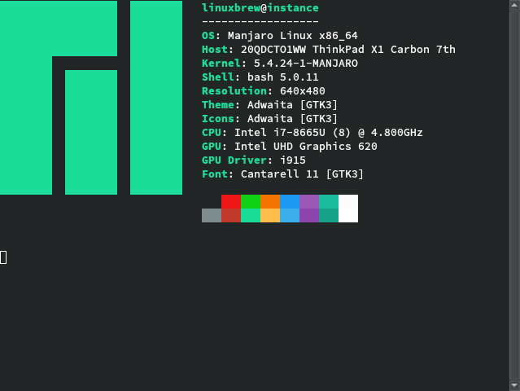

# Yuhonas dotfiles 



My overbaked, labour of love dotfiles for both manjaro linux / osx, _mostly_ everything I
need to bootstrap a machine to a state with everything I need

## Gettting Started

This repo is broken down into the following ansible roles

#### dotfiles

The minimum set of config/tools I need to work from the commandline, some
highlights

* zsh w/custom config
* tmux + plugins
* fd/fasd/bat/exa/fzf
* mackup for dotfile symlinking
* tldr with custom key bindings for inline help lookups
* vim w/custom config

See also [main.yml](./roles/dotfiles/tasks/main.yml)

#### developer

What I generally need for development some highlights

* ruby, python, node & others managed by asdf
* thing's I felt fell outside the minimal toolset I have in dotfiles

See also [main.yml](./roles/developer/tasks/main.yml)

#### linux-apps

All my favourite DE linux apps (assumes arch based system)

See also [main.yml](./roles/linux-apps/tasks/main.yml)

#### osx-defaults

A sane set of macos defaults

See also [main.yml](./roles/osx-defaults/tasks/main.yml)

#### osx-apps

All my favourite osx apps

See also [main.yml](./roles/osx-apps/tasks/main.yml)

#### screenshot

Generates the terminal based screenshot used above

See also [main.yml](./roles/screenshot/tasks/main.yml)

### Prerequisites

1. Xcode Command Line Tools (osx only)
2. [git](https://git-scm.com/)
3. [Ansible](https://www.ansible.com/)
4. [Homebrew](https://brew.sh/)

### Installing

Use the bootstrap script to install any depedencies and run the
[playbook](./playbook.yml)

```
$ bash <(curl -s https://raw.githubusercontent.com/yuhonas/dotfiles/master/bootstrap.sh)
````

## Running the tests

This repo uses [molecule](https://molecule.readthedocs.io/en/latest/) and docker
to lint, provision and test the playbook

```
$ molecule test
```
