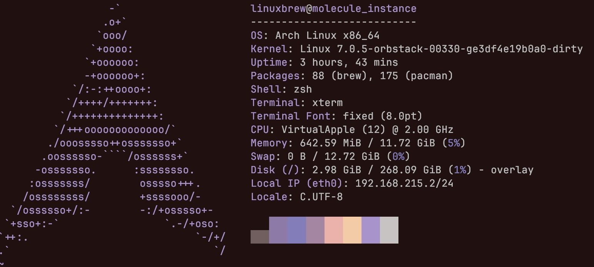

# Yuhonas dotfiles [](https://github.com/yuhonas/dotfiles/actions/workflows/ci.yml)



My overbaked, labour of love dotfiles for both osx / archlinux, mostly everything I need to bootstrap a machine to a productive state

## What's in it?

<!-- BEGIN SUMMARY.md -->

### Shell, terminal & prompt

- [atuin](https://docs.atuin.sh/) — syncable, searchable shell history
- [ghostty](https://ghostty.org/) — gpu-accelerated terminal
- [kitty](https://sw.kovidgoyal.net/kitty/) — hackable, scriptable terminal emulator
- [oh my zsh](https://ohmyz.sh/) — zsh framework and plugins
- [starship](https://starship.rs/) — fast, cross-shell prompt
- [tmux](https://github.com/tmux/tmux) — terminal multiplexer
- [tmux-plugin-manager (tpm)](https://github.com/tmux-plugins/tpm) — plugin manager for tmux; installs configured plugins
- [zellij](https://zellij.dev/) — terminal workspace / tmux alternative
- [zsh](https://www.zsh.org/) — default interactive shell

### CLI essentials & “modern Unix” tools

- [bash](https://www.gnu.org/software/bash/) — up-to-date bash shell
- [bat](https://github.com/sharkdp/bat) — syntax-highlighting `cat` replacement
- [coreutils](https://www.gnu.org/software/coreutils/) — gnu core utilities
- [diffutils](https://www.gnu.org/software/diffutils/) — gnu `diff` with color support
- [dua-cli](https://github.com/Byron/dua-cli) — disk usage analyzer (`ncdu` alternative)
- [eza](https://github.com/eza-community/eza) — modern `ls` replacement
- [fd](https://github.com/sharkdp/fd) — user-friendly `find` replacement
- [fzf](https://github.com/junegunn/fzf) — fuzzy finder for files, history, and more
- [gawk](https://www.gnu.org/software/gawk/) — gnu awk
- [git](https://git-scm.com/) — version control
- [glow](https://github.com/charmbracelet/glow) — terminal markdown viewer
- [ispell](https://www.gnu.org/software/ispell/) — spell checker
- [less](https://www.greenwoodsoftware.com/less/) — pager
- [lesspipe](https://www-zeuthen.desy.de/~friebel/unix/lesspipe.html) — preprocessors for `less` on many file types
- [lsd](https://github.com/lsd-rs/lsd) — `ls` replacement with icons
- [readline](https://tiswww.case.edu/php/chet/readline/rltop.html) — line-editing library
- [ripgrep](https://github.com/BurntSushi/ripgrep) — fast recursive grep
- [rsync](https://rsync.samba.org/) — up-to-date file sync utility
- [tealdeer](https://github.com/dbrgn/tealdeer) — fast `tldr` community man-page summaries
- [the silver searcher](https://github.com/ggreer/the_silver_searcher) — code search (`ag`)
- [thefuck](https://github.com/nvbn/thefuck) — suggests fixes after mistyped commands
- [wget](https://www.gnu.org/software/wget/) — non-interactive http downloads
- [zoxide](https://github.com/ajeetdsouza/zoxide) — smart directory jumping (`z`)

### Editors, notes & docs

- [cheat](https://github.com/cheat/cheat) — customizable cheat sheets (like tldr)
- [cheat community cheatsheets](https://github.com/cheat/cheatsheets) — upstream cheat sheet collection
- [neovim](https://neovim.io/) — modal text editor
- [obsidian](https://obsidian.md/) — markdown notes and knowledge base
- [pandoc](https://pandoc.org/) — universal document converter
- [visual studio code](https://code.visualstudio.com/) — gui editor / ide

### Developer tooling & runtimes

- [awscli](https://aws.amazon.com/cli/) — aws api command-line interface
- [bruno](https://www.usebruno.com/) — open-source api client (collections on disk)
- [btop](https://github.com/aristocratos/btop) — resource monitor in the terminal
- [ctags](https://ctags.io/) — tag indexes for source navigation
- [entr](https://eradman.com/entrproject/) — run commands when files change
- [gh](https://cli.github.com/) — github cli
- [ghq](https://github.com/x-motemen/ghq) — clone and organize remote repos locally
- [git-delta](https://github.com/dandavison/delta) — syntax-highlighted git diffs and pagers
- [gnupg](https://www.gnupg.org/) — encryption and signing
- [just](https://github.com/casey/just) — command runner / makefile alternative
- [lazygit](https://github.com/jesseduffield/lazygit) — terminal ui for git
- [mise](https://mise.jdx.dev/) — polyglot runtime and tool version manager
- [nmap](https://nmap.org/) — network discovery and port scanning
- [orbstack](https://orbstack.dev/) — fast docker and linux vms
- [pgcli](https://www.pgcli.com/) — postgres repl with autocomplete
- [pnpm](https://pnpm.io/) — fast node package manager
- [postico](https://eggerapps.at/postico/) — postgres gui client
- [redis](https://redis.io/) — in-memory data store for local development
- [ruby-build](https://github.com/rbenv/ruby-build) — ruby version definitions for mise
- [sqlite](https://www.sqlite.org/) — embedded sql database
- [uv](https://github.com/astral-sh/uv) — fast python package installer

### Data, logs, json & downloads

- [aria2](https://aria2.github.io/) — lightweight multi-protocol downloader
- [borgbackup](https://www.borgbackup.org/) — deduplicating encrypted backups
- [fx](https://github.com/antonmedv/fx) — interactive json explorer
- [gemini-cli](https://github.com/google-gemini/gemini-cli) — gemini ai from the terminal
- [grex](https://github.com/pemistahl/grex) — generate regexes from example strings
- [imagemagick](https://imagemagick.org/) — image manipulation (e.g. pywal)
- [jdupes](https://github.com/jbruchon/jdupes) — fast duplicate file finder
- [jq](https://jqlang.github.io/jq/) — json processor for the shell
- [lnav](https://lnav.org/) — log file viewer with sql and highlights
- [md5deep](https://github.com/jessek/hashdeep) — hashing and auditing file trees
- [p7zip](https://p7zip.sourceforge.net/) — 7zip archiver
- [poppler](https://poppler.freedesktop.org/) — pdf utilities (used by lesspipe)
- [pv](https://www.ivarch.com/programs/pv.shtml) — pipe viewer (throughput and progress)
- [w3m](https://github.com/tats/w3m) — text-mode web browser
- [xh](https://github.com/ducaale/xh) — httpie-style curl alternative

### Python packages

- [csvkit](https://csvkit.readthedocs.io/) — cli tools for working with csv files
- [osx-colors](https://github.com/kevinmwl/osx-colors) — change system accent and highlight colors from the cli
- [posting](https://github.com/darrenburns/posting) — terminal http/api client
- [python-dotenv](https://github.com/theskumar/python-dotenv) — load `.env` files into the environment
- [pywal16](https://github.com/eylles/pywal16) — generate color schemes from wallpapers

### Node packages

- [socket](https://socket.dev/) — cli for safer dependency auditing

### Web browsers & privacy

- [brave browser](https://brave.com/) — chromium-based browser with ad blocking
- [tor browser](https://www.torproject.org/) — anonymous browsing over tor
- [zen browser](https://zen-browser.app/) — privacy- and productivity-focused browser

### Productivity & utilities

- [1password](https://1password.com/) — password and secrets manager
- [caffeine](https://www.caffeine-app.net/) — prevent display sleep during long tasks
- defaultkeybinding.dict — custom emacs-style key bindings in cocoa text fields
- [dockutil](https://github.com/kcrawford/dockutil) — manage dock items from the cli
- [google drive](https://www.google.com/drive/) — cloud file sync client
- [karabiner-elements](https://karabiner-elements.pqrs.org/) — keyboard remapping and complex modifications
- [raycast](https://www.raycast.com/) — launcher / spotlight replacement
- [rectangle](https://rectangleapp.com/) — keyboard-driven window snapping
- [switchaudio-osx](https://github.com/deweller/switchaudio-osx/) — switch audio input/output from the cli
- [uninstallpkg](https://www.corecode.io/uninstallpkg/) — inspect and remove installer packages
- zappy — screenshot and screen recording tool

### media

- [spotify](https://www.spotify.com/) — music streaming
- [vlc](https://www.videolan.org/) — media player

### Fonts

- fira code — monospaced font with ligatures
- hack — monospaced programming font
- jetbrains mono — monospaced font tuned for ides

### Dotfiles & configuration

- [mackup](https://github.com/lra/mackup) — symlink application configs into `$HOME`
- osx-defaults.sh — applies system preference defaults (not a package install)

<!-- END SUMMARY.md -->

## Installing

### Prerequisites

1. Xcode Command Line Tools (osx only)
2. [git](https://git-scm.com/)
3. [Ansible](https://www.ansible.com/)
4. [Homebrew](https://brew.sh/)

Use the bootstrap script to install any depedencies and run the
[playbook](./playbook.yml)

```
$ bash <(curl -s https://raw.githubusercontent.com/yuhonas/dotfiles/master/bootstrap.sh)
```

## Running the tests

This repo uses [molecule](https://docs.ansible.com/projects/molecule/) and docker
to lint, provision and test the playbook

```
$ molecule test
```

## Trying it out with Docker

Every test run molecule generates a _minimal_ docker base image which is then published & can be found under [releases](https://github.com/yuhonas/dotfiles/releases)

See also

* [ci.yml](https://github.com/yuhonas/dotfiles/blob/master/.github/workflows/ci.yml)
* [molecule.yml](https://github.com/yuhonas/dotfiles/blob/master/molecule/default/molecule.yml)
