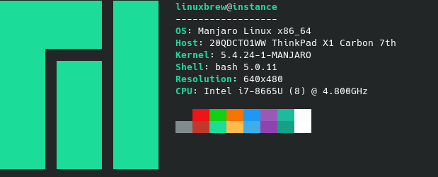

# Yuhonas dotfiles 



My overbaked, labour of love dotfiles for both manjaro linux / osx, _mostly_ everything I
need to bootstrap a machine to a state with everything I need

## Gettting Started

This repo is broken down into the following ansible roles

* [dotfiles](./roles/dotfiles/tasks/main.yml) - The minimum set of config/tools I need
  to work from the commandline
* [developer](./roles/developer/tasks/main.yml) - What I generally need for
  development
* [linux-apps](./roles/linux-apps/tasks/main.yml) - All my favourite DE linux
  apps (assumes arch based system)
* [osx-defaults](./roles/osx-defaults/tasks/main.yml) - A sane set of macos defaults
* [osx-apps](./roles/osx-apps/tasks/main.yml) - All my favourite osx apps
* [screenshot](./roles/screenshot/tasks/main.yml) - Generates the terminal based
  screenshot used above

### Prerequisites

1. Xcode Command Line Tools (osx only)
2. [git](https://git-scm.com/)
3. [Ansible](https://www.ansible.com/)
4. [Homebrew](https://brew.sh/)

### Installing

Use the bootstrap script to install any depedencies and run the
[playbook](./playbook.yml)

```
$ bash <(curl -s https://raw.githubusercontent.com/yuhonas/dotfiles/master/bootstrap.sh)
````

## Running the tests

This repo uses [molecule](https://molecule.readthedocs.io/en/latest/) and docker
to lint, provision and test the playbook

```
$ molecule test
```
